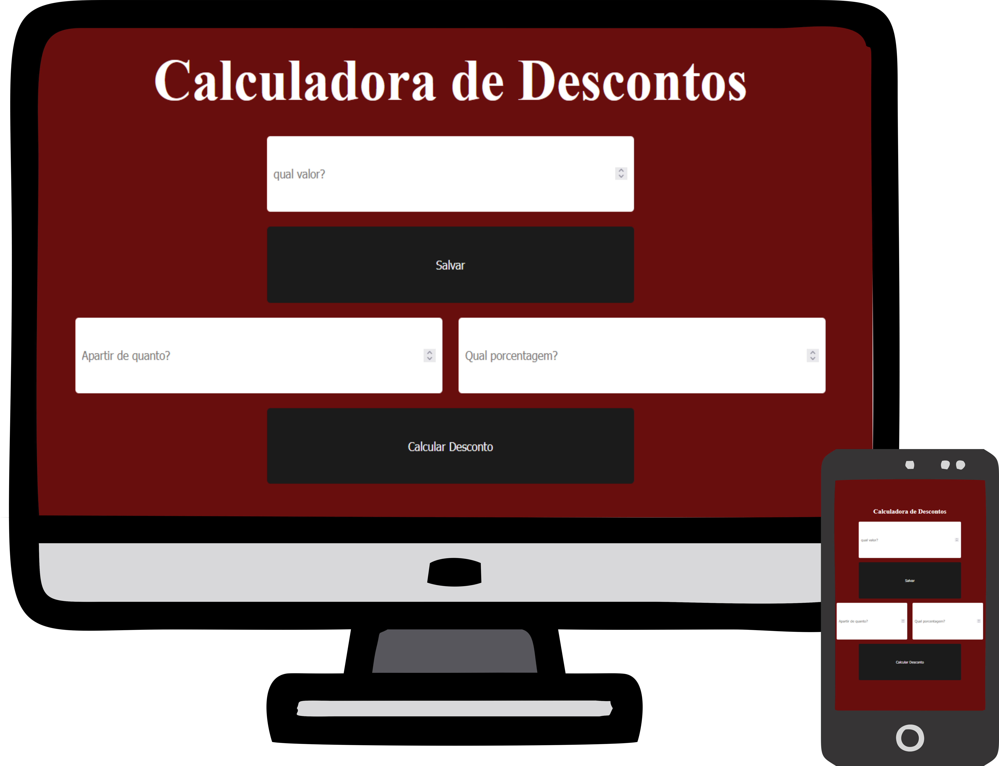

# Calculadora de Descontos

Esta calculadora permite que você **adicione e salve um número ilimitado de itens** que está comprando. Você pode definir:

- Uma **faixa mínima de preço** a partir da qual os itens receberão desconto.

- A **porcentagem de desconto** que será aplicada.

O projeto foi desenvolvido utilizando:

- **JavaScript** para toda a parte funcional, garantindo interatividade e cálculos dinâmicos.

- **CSS responsivo**, permitindo o uso eficiente em dispositivos como celular, tablet e computador.

- **HTML semântico**, para estruturar o conteúdo de forma acessível e organizada.

